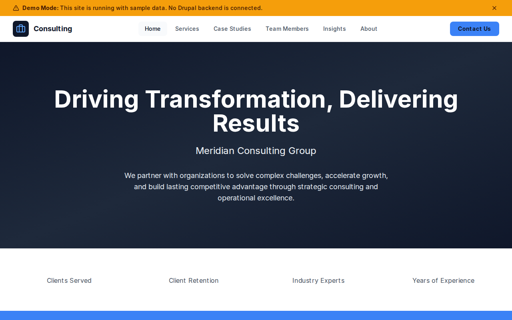

# Decoupled Consulting

A consulting firm website starter template for Decoupled Drupal + Next.js. Built for management consulting firms, strategy practices, and professional services companies.



## Features

- **Services** - Showcase consulting services across strategy, operations, and digital transformation
- **Case Studies** - Highlight client engagements with measurable results and industry context
- **Team Directory** - Consultant and partner profiles with expertise and contact details
- **Insights & Thought Leadership** - Publish industry articles and strategic perspectives
- **Modern Design** - Clean, accessible UI optimized for professional services content

## Quick Start

### 1. Clone the template

```bash
npx degit nextagencyio/decoupled-consulting my-consulting
cd my-consulting
npm install
```

### 2. Run interactive setup

```bash
npm run setup
```

This interactive script will:
- Authenticate with Decoupled.io (opens browser)
- Create a new Drupal space
- Wait for provisioning (~90 seconds)
- Configure your `.env.local` file
- Import sample content

### 3. Start development

```bash
npm run dev
```

Visit [http://localhost:3000](http://localhost:3000)

---

## Manual Setup

<details>
<summary>Click to expand manual setup steps</summary>

### Authenticate with Decoupled.io

```bash
npx decoupled-cli@latest auth login
```

### Create a Drupal space

```bash
npx decoupled-cli@latest spaces create "My Consulting Firm"
```

Note the space ID returned. Wait ~90 seconds for provisioning.

### Configure environment

```bash
npx decoupled-cli@latest spaces env 1234 --write .env.local
```

### Import content

```bash
npm run setup-content
```

This imports:
- Homepage with hero, statistics, and CTAs
- 3 Consulting Services (strategy, operations, digital transformation)
- 3 Case Studies (healthcare, fintech, manufacturing)
- 3 Team Members (managing partner, partners)
- 3 Insights (AI strategy, supply chains, talent)
- 3 Static Pages (About, Contact, Careers)

</details>

## Content Types

### Service
- **title**: Service name
- **body**: Detailed service description with offerings
- **service_category**: Category (Strategy, Operations, Digital)
- **image**: Featured image

### Case Study
- **title**: Case study headline
- **body**: Full engagement narrative with challenge, solution, and results
- **client_name**: Client organization name
- **industry**: Industry sector
- **results_summary**: Brief outcomes summary
- **image**: Featured image

### Team Member
- **title**: Consultant name
- **body**: Professional biography
- **position**: Title/role
- **email**: Professional email
- **phone**: Contact phone
- **photo**: Professional headshot

### Insight
- **title**: Article headline
- **body**: Thought leadership content
- **insight_category**: Topic category
- **image**: Featured image

## Customization

### Colors & Branding
Edit `tailwind.config.js` to customize colors, fonts, and spacing.

### Content Structure
Modify `data/consulting-content.json` to add or change content types and sample content.

### Components
React components are in `app/components/`. Update them to match your design needs.

## Demo Mode

Demo mode allows you to showcase the application without connecting to a Drupal backend.

### Enable Demo Mode

```bash
NEXT_PUBLIC_DEMO_MODE=true
```

### Removing Demo Mode

1. Delete `lib/demo-mode.ts`
2. Delete `data/mock/` directory
3. Delete `app/components/DemoModeBanner.tsx`
4. Remove `DemoModeBanner` from `app/layout.tsx`
5. Remove demo mode checks from `app/api/graphql/route.ts`

## Deployment

### Vercel (Recommended)
[](https://vercel.com/new/clone?repository-url=https://github.com/nextagencyio/decoupled-consulting)

### Other Platforms
Works with any Node.js hosting platform that supports Next.js.

## Documentation

- [Decoupled.io Docs](https://www.decoupled.io/docs)
- [Next.js Documentation](https://nextjs.org/docs)
- [Drupal GraphQL](https://www.decoupled.io/docs/graphql)

## License

MIT
